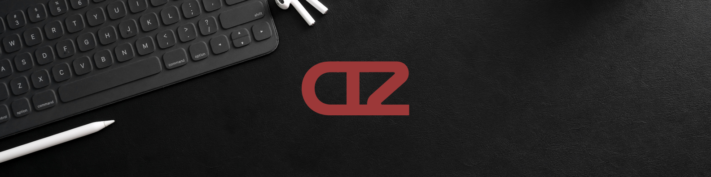

## Hello World!, I'm Francis👋

I'm a Computer Science student and freelance graphic designer with a passion for both tech and creativity. I enjoy solving problems, creating clean visuals, and constantly learning new things. Whether I’m coding or designing, I strive to produce work that's both functional and visually striking.

My work blends creativity with logic.

👩🏻‍💻 I’m currently working on ...
🌱 I’m currently learning ...
  
<!--
**francissolangon/francissolangon** is a ✨ _special_ ✨ repository because its `README.md` (this file) appears on your GitHub profile.

Here are some ideas to get you started:

- 🔭 I’m currently working on ...
- 🌱 I’m currently learning ...
- 👯 I’m looking to collaborate on ...
- 🤔 I’m looking for help with ...
- 💬 Ask me about ...
- 📫 How to reach me: ...
- 😄 Pronouns: ...
- ⚡ Fun fact: ...
-->
